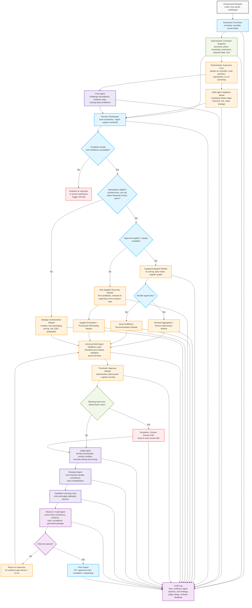

# Complemented Universal Governance Flow

This version merges the **universal multi-agent validation architecture** with the **governance and decision-quality flow**.

## What this adds

Relative to the universal validation flow, this version introduces:

- a **Deterministic Constraint Snapshot** early in the process
- a **Decision Workspace** where hard rules and agent outputs are fused
- a **Critic Agent** to challenge assumptions and evidence quality
- a **Judge Agent** to resolve conflicts and set final routing/ranking
- a **Reviewer Agent** to score trace quality and consistency
- a **Feedback Learning Loop** to calibrate critic and judge behavior over time

## Key design principle

The multi-agent team remains **mandatory across all processes**.
Nothing can move to PO, approval routing, supplier onboarding outcome, or escalation handoff unless it has passed through:

1. intake triage validation
2. lane-specific preparation
3. universal pre-release multi-agent validation
4. governance review by critic, judge, and reviewer

## Complemented Mermaid flow

## Why this works better

### 1. The second flow now strengthens, not replaces, universal validation
Your earlier requirement remains intact:
- the multi-agent squad is present at intake
- the multi-agent squad is present again before release
- no lane bypasses it

### 2. The critic, judge, and reviewer now have clean roles
- **Critic** questions assumptions before the workflow hardens
- **Judge** arbitrates after deterministic enforcement and escalation signals are known
- **Reviewer** checks whether the final decision is actually high quality and auditable

### 3. Decision quality is separated from execution speed
Catalog and marketplace flows can stay fast, but they still go through:
- decision workspace
- universal validation
- judge/reviewer governance
- observer gate

### 4. Deterministic and agentic controls are clearly separated
- deterministic layer decides hard constraints and blocking rules
- agentic layer evaluates nuance, tradeoffs, sparse data, and strategic fit
- governance layer challenges and resolves the final decision

## Recommended language for presentation

A simple way to explain this architecture is:

> Every request enters through a generative front door, is grounded by deterministic procurement constraints, challenged by a multi-agent team and critic, routed through the right fulfillment lane, then forced back through a universal validation and governance stack before any PO, approval, escalation, or onboarding outcome is released.

## Suggested implementation mapping

- `extractor.py`
  - front door normalization and extraction
- `rule_engine.py`
  - deterministic constraint snapshot and blocking rules
- `orchestrator.py`
  - always-on multi-agent squad and synthesis
- `supplier_discovery.py`
  - new supplier discovery and provisional onboarding path
- `observer.py`
  - final audit gate
- future modules to add:
  - `critic_agent.py`
  - `judge_agent.py`
  - `reviewer_agent.py`
  - `decision_workspace.py`
  - `learning_loop.py`
