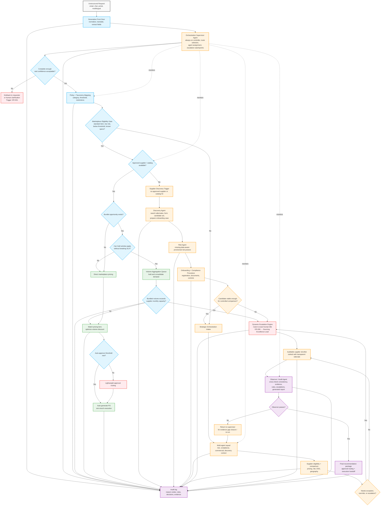

# Refined Agentic Procurement Flow

This version tightens the routing model around three principles:

1. **An agent is always in the loop** through an always-on orchestration supervisor.
2. **Approved supplier / catalog gaps trigger a supplier discovery sub-process** instead of a dead end.
3. **A final observer validates the package** before the recommendation is released.

## Mermaid flow

## What changed relative to the current design

### 1) Always-on orchestration supervisor
The supervisor is not just another optional specialist. It sits between extraction and routing and stays logically attached through the full lifecycle.

Suggested responsibilities:
- choose the primary lane: clarification, marketplace, supplier discovery, or strategic orchestration
- assign the minimum agent set for the case
- keep escalation watchpoints active
- re-run the workflow when the observer flags evidence gaps

### 2) Approved supplier unavailable now becomes a controlled sub-process
The old branch routed straight to strategic orchestration. The new branch is more explicit:
- trigger supplier discovery
- let the risk agent work with incomplete data instead of pretending certainty
- run onboarding and compliance checks before the new supplier joins comparison
- escalate if the candidate cannot be validated enough for controlled consideration

### 3) Observer / audit agent before release
This sits after shortlist generation and before final recommendation release.

Suggested checks:
- blocking escalations are reflected in the recommendation
- evidence exists for the chosen supplier and route
- pricing, policy, and escalation logic are internally consistent
- generated narrative matches the structured facts
- missing data is disclosed, not hidden

## Suggested integration points in the current repo

- `backend/services/extractor.py` remains the front door
- `backend/services/pipeline.py` should call the supervisor immediately after extraction
- `backend/services/supplier_filter.py` still handles standard eligibility filtering
- `backend/services/supplier_discovery.py` should own the new supplier branch
- `backend/services/orchestrator.py` should receive discovery context when discovery is triggered
- `backend/services/observer.py` should run after shortlist generation and before the final response is returned
- `backend/services/escalation.py` should remain deterministic and continue outputting exact human titles

## Minimal response extensions to support this

Recommended new fields for the analysis response:
- `supervisor_decision`
- `supplier_discovery_case`
- `observer_report`
- `final_release_status`

Those four additions will make the new flow visible in both the API and the frontend.
