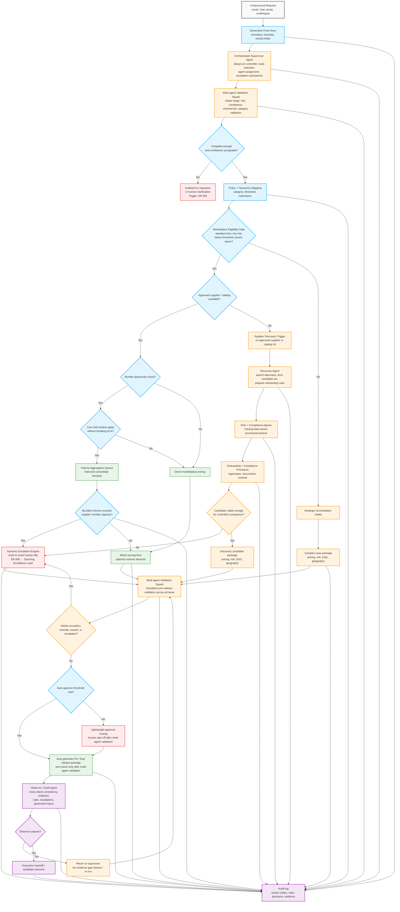

# Universal Multi-Agent Validation Flow

This revision makes the multi-agent team mandatory across all meaningful paths, including marketplace, bundled demand, supplier discovery, and strategic orchestration.

## Design principle

The multi-agent team is no longer a branch used only for complex cases.
It is now a **mandatory control layer** with two checkpoints:

1. **Intake triage checkpoint**
   Validates extraction quality, completeness, category interpretation, and early risk signals.

2. **Pre-release validation checkpoint**
   Validates pricing, capacity, policy fit, compliance posture, risk, and recommendation coherence before any PO, shortlist, or recommendation can be released.

That means direct marketplace pricing is still fast, but it is never unvalidated.

## Mermaid flow

## What changed

### 1. The multi-agent squad is now mandatory twice
- **At intake**, before the system even accepts the request as actionable
- **Before release/execution**, regardless of whether the case came from marketplace pricing, bundling, discovery, escalation, or strategic sourcing

### 2. Marketplace is no longer a bypass
In the previous version, direct marketplace pricing could reach approval logic without passing through the full multi-agent team.
Now both:
- `Direct marketplace pricing`
- `Volume aggregation / pricing tier match`

must pass through the same **mandatory pre-release validation squad**.

### 3. Discovery and escalation also converge into the same validation layer
Even when the system escalates or discovers a new supplier, the case still returns into the universal multi-agent validation checkpoint before it can move toward approval or execution.

## Implementation intent for the repo

This should translate into the backend as:

- `pipeline.py`
  - run a first multi-agent pass right after extraction
  - run a second multi-agent validation pass after lane-specific preparation and before recommendation/approval routing

- `orchestrator.py`
  - stop being treated as only the complex-case engine
  - become the universal validation and synthesis layer for every path

- `observer.py`
  - remain the final release gate after the universal multi-agent validation layer

## Simple rule to keep in mind

**No PO, no shortlist, no release package, and no human approval handoff should occur unless the multi-agent team has validated the case first.**
